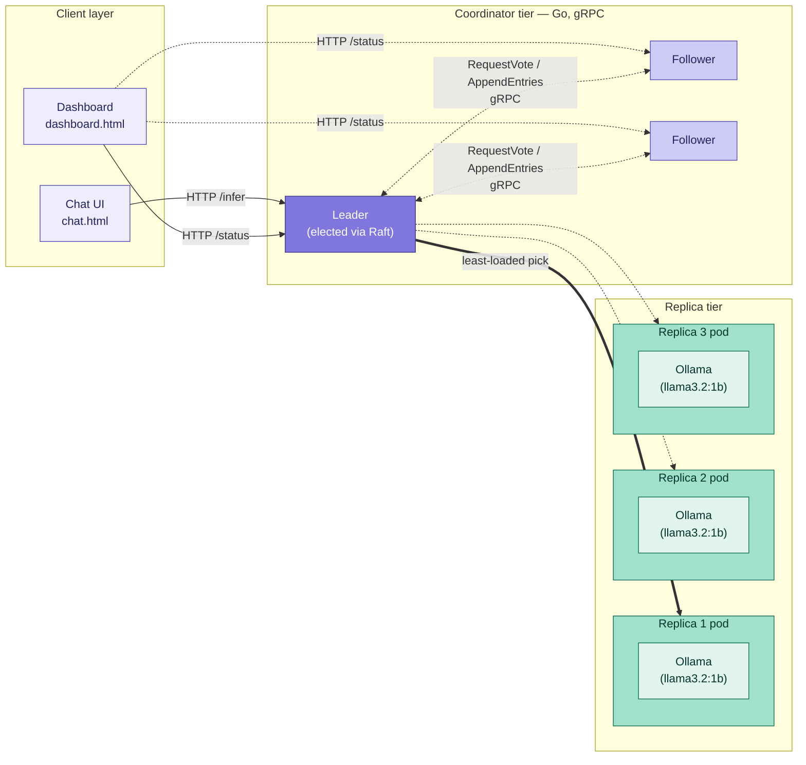

# Fault-tolerant AI inference coordinator

A distributed coordination system that implements the Raft consensus algorithm from scratch in Go, and applies it to a real, working problem: reliably routing AI inference requests across a cluster of replica nodes, with automatic failover if any coordinator or replica goes down.

## Why this exists

Consensus algorithms like Raft are the backbone of systems like etcd (which itself backs Kubernetes), and understanding one deeply, by building it rather than importing a library, is one of the clearest ways to demonstrate real distributed-systems fundamentals. This project builds Raft from the ground up (leader election, log replication, safety rules, and the PreVote extension used by production systems like etcd), then wires it into a genuinely useful application: coordinating AI inference serving, a domain currently central to infrastructure and platform engineering work.

The goal was not to build a production inference server (real systems like Triton or vLLM already do that well) but to build the *coordination layer* around one, with the same fault-tolerance guarantees that real infrastructure teams rely on.

## Tech stack

- **Go** — coordinator and replica services, Raft implementation
- **gRPC / Protocol Buffers** — inter-node networking for Raft RPCs (RequestVote, AppendEntries, PreVote)
- **Docker** — containerized coordinator and replica images
- **Kubernetes (kind)** — local cluster orchestration; coordinators run as a StatefulSet (stable network identity, required for Raft peer discovery), replicas as a StatefulSet behind a headless service
- **Ollama** — local LLM inference runtime (Llama 3.2 1B); one instance runs inside each replica pod, reached via `host.docker.internal`
- **Vanilla HTML/CSS/JS** — live dashboard and chat interface, no framework

## Architecture

The system has two independent tiers, plus a thin client layer:



**Coordinators** run the Raft consensus protocol among themselves to elect a single leader and keep a replicated log. This is the only place consensus is used — it answers exactly one question reliably: *who is currently in charge*. Only the current leader accepts client requests; followers redirect to the known leader.

**Replicas** are simple, independent workers, each wrapping a local Ollama instance. They are not part of the Raft cluster and do not vote or replicate anything. The leader tracks their health (periodic pings) and current load (active in-flight requests), and routes each incoming request to the least-loaded healthy replica — a lightweight load-balancing decision, deliberately kept separate from consensus, since per-request routing does not need the strong agreement that leadership does.

A live dashboard polls each coordinator's `/status` endpoint and visualizes cluster state, leadership history, replica load, and a running activity log. A chat interface sends real prompts to the current leader and displays responses, automatically following the leader if it changes mid-conversation.

## What's implemented

- Randomized-timeout leader election with term-based logical clocks
- Log replication with consistency checking, conflict truncation, and per-follower catch-up (nextIndex/matchIndex backoff)
- The Raft safety rule restricting direct commits to entries from the leader's own term
- **PreVote**, the extension used by etcd and other production Raft implementations to prevent disruptive re-elections from partitioned or restarting nodes
- Basic state persistence (term, vote, log) surviving process restarts
- Real gRPC networking between coordinator processes (not just in-process channels)
- Health-tracked, least-loaded routing to inference replicas, with leader-only activation and follower-to-leader redirect
- Real local LLM serving via Ollama, full request/response flow
- Full Docker + Kubernetes deployment (StatefulSets for both tiers), with a single script (`deploy/start-cluster.sh`) that builds, loads, deploys, and exposes the entire cluster
- A live, animated status dashboard and a working chat interface

## Engineering challenges solved

Building this surfaced several real distributed-systems bugs, each a useful case study in its own right:

- **A concurrent map write panic.** Multiple goroutines updating `nextIndex`/`matchIndex` for different peers raced on the same map without synchronization. Fixed with a mutex; a good concrete example of why Go's runtime crashes loudly on unsynchronized map access rather than silently corrupting data.
- **A deadlock in `BecomeLeader`.** A persistence call inside a function that already held the node's mutex tried to acquire the same (non-reentrant) mutex again, hanging the process the moment any node won an election.
- **A lifecycle bug causing silent process exit.** After being demoted from leader, a node's lifecycle loop returned instead of continuing as a follower, which meant a demoted coordinator's entire process would exit rather than rejoin the cluster.
- **A disruptive re-election storm.** Nodes that failed to win an election still bumped their own term on every attempt, and a healthy leader is required to step down on seeing any higher term — meaning a single flaky node could force the whole cluster to keep re-electing indefinitely. Fixed by implementing PreVote: a node only starts a real election if a majority would plausibly vote for it first, without mutating any real state.
- **A stale-restart safety gap.** A coordinator killed and restarted came back with no memory of its previous term, and could climb past a healthy cluster's term through repeated election attempts. Fixed with basic term/vote/log persistence to disk.

## Known limitations

- Cluster membership is static (fixed at 3 coordinators); dynamic membership changes are not implemented.
- Local development exposes coordinators via `kubectl port-forward`; a production deployment would use a NodePort, LoadBalancer, or Ingress instead, since port-forwarding is a manual developer convenience, not a real external-access mechanism.
- Replica health is not itself Raft-replicated; a newly elected leader rebuilds its view of replica health from scratch.

## Running it

```bash
./deploy/start-cluster.sh
```

This builds the coordinator and replica Docker images, creates (or reuses) a local `kind` Kubernetes cluster, loads the images, applies the manifests, waits for all pods to be healthy, and starts port-forwarding for all three coordinators.

Then open either:
- `web/dashboard.html` — live cluster status, term history, replica load, activity log
- `web/chat.html` — send real prompts to the cluster and see responses

Requires Docker, `kind`, `kubectl`, and Ollama (with a model pulled, e.g. `ollama pull llama3.2:1b`) running on the host.